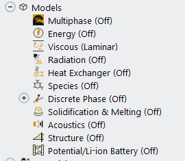
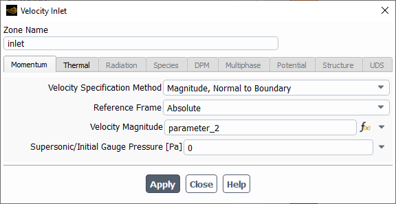
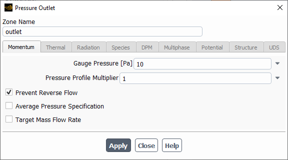
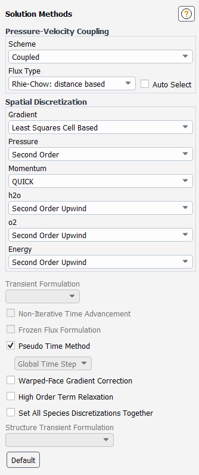
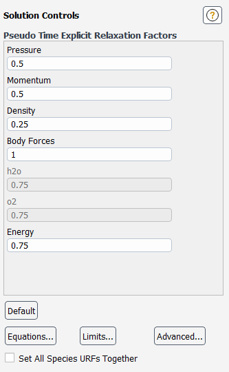
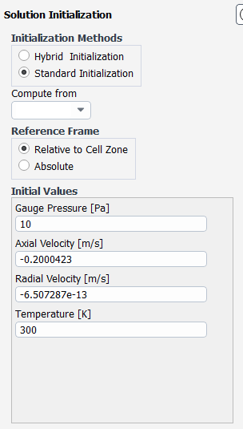
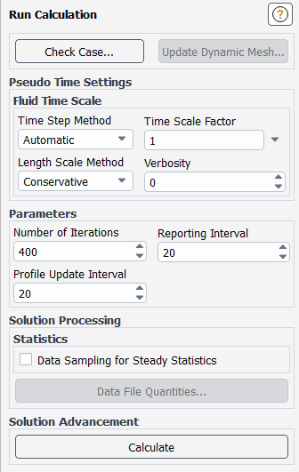
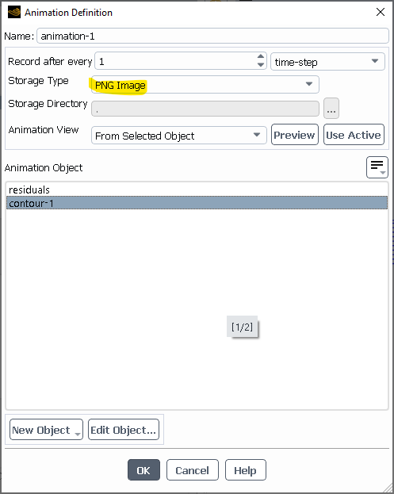
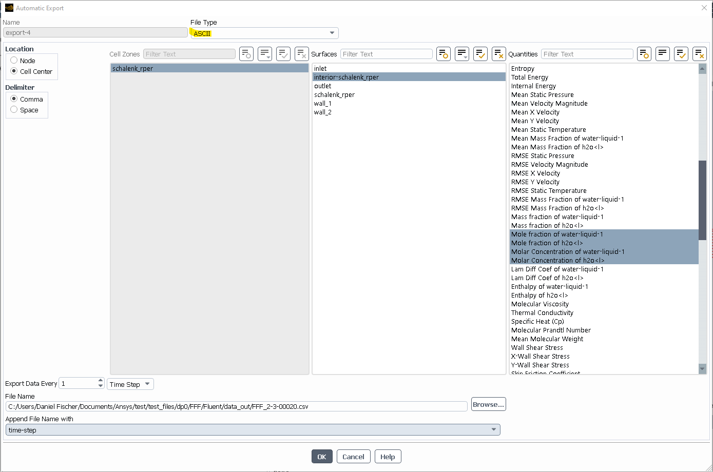
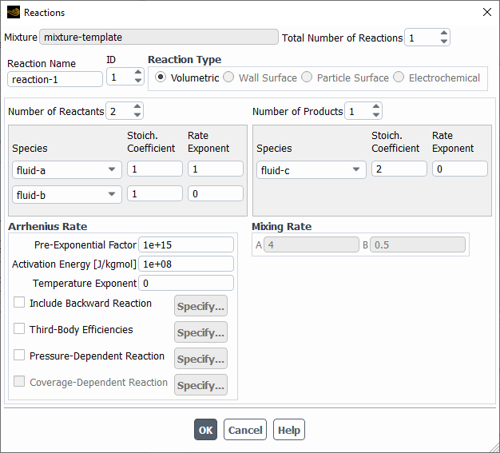

# Notes

# Running a new case

1. Make shure the directory the auto export writes files to is empty
    - if not run add_data.py

2. Make shure the case is setup within cases.json (you can put all relevant parameters here. helps if you need to look them up later ;-) )

3. Run the case

4. Take a look at the latest results with running watcher.py (Config is done in watcher.json)

## Ansys Configuration

* Change UI language
    - go to ansys installation location
    - open (Ansys Inc -> Ansys Student -> v221(version number) -> ProductConfig.exe)
    - change language to desired one
## Ansys Fluent

User Interface Basics (DesignModeler + Mesher)

++strg++ + ++scroll wheel++ -> move
++scroll wheel++ -> tilt

### Workflow

0. First time opening
    - Drop **Fluent Flow(Fluent)** Workflow to Project
    - Doubleclick on Geometry
    - Close Window

1. Create Geometry in DesignModeler
    - rightclick **Geometry** -> **New DesignModeler Geometry...**
    - click on XY-Plane (Z arrow)
        - Axisymetric Problems
            - **radial direction**: y
            - **axial direction**: x (axis of rotation)
    - change from **Modelling** to **Sketching**
        - create sketch with drawing and constraints
        - add dimensions with dimensions
    - Highlight Sketch in Model tree -> Click **Concepts** -> **Surfaces from Sketch**
    - Click **Generate**
    - Check for errors in Model tree

2. Open mesher
    - name **Edges** (give usefull names e.g. inlet, outlet, wall_1, wall_2, ...) (shortkey ++N++)
        - select edge -> rightclick -> **create named selection**
    - create divisions (generate mesh near faces)
        - rightclick Mesh -> **Insert** -> **Sizing**
            - select edges -> Click Apply in Geometry tab
            - select type (e.g. Number of Devisions)
    - create inflation (create higher resolution near walls)
        - rightclick Mesh -> **Insert** -> **Inflation**
            - select Face -> click **Apply** under Geometry
            - select edges -> click **Apply** under Boundary
            - leave rest as default settings
    - create method (create inner mesh)
        - rightclick Mesh -> **Insert** -> **Method**
            - highlight body -> Click **Apply**
            - Definition Tab
                - Method: MultiZone Quad/Tri
    - click **Generate**
    - view mesh by clicking mesh in model tree

3. Setup
    - General
        - 
    - Models 
        - 
    - Materials
        - Add fluids
            - RightClick Fluids -> **New**
            - Highlight all needed fluids from Database -> Click **Copy**
        - Delete all fluids not used
            - RightClick Fluid -> Click **Delete**
        - Create Mixture
            - under models --> **Species** --> activate **Species Transport**
            - under materials --> **Mixture** --> ++rightclick++ --> mixture-template --> **Edit**
            - under **Mixture Species** --> Edit
                - add all created fluids to mixture
                - remove non used species from mixture
                - delete non used materials under materials tab

    - Cell Zone Conditions
        - RightClick surface_body -> **Edit** -> Material Name: "fluid to use"

    - Boundry Conditions
        - inlet
            - 
        - outlet
            - 

    - Methods
        - 

    - Contorls
        - 

    - Initialization
        - 

    - Run calculation
        - 

4. Solution
    - get a first impression of results
        - expand **Results** tab within model tree
        - expand **Graphics** tab
        - ++rightclick++ **Contours** -> **New**
        - select variable of interest from dropdown menus
        - click **Save/Display**
        - close settings window with **Close**

5. Results

    - export results 
        - create plane
            - highlight **Insert** in menu bar -> **Location** -> Plane
            - default settings are ok for this case
            - click **Apply**
            - plane should be visible within viewport
        - add results to plane
            - hihghlight **Insert** in menu bar -> **Contour**
            - select the just created plane at Locations
            - select the desired variable within Variable
            - click **Apply**
        - export data
            - highlight **File** in menu bar -> **Export** -> **Export...**
            - select just created plane at Locations
            - highlight variables that need to be exported (geometry information is already there due to ticked **Export Geometry Information**)
            - select export file location at **File**
            - click **save**

# Animations

## Create Animations
- click **Solution** tab --> Activities --> Create --> Solution Animations
    - 
    - Storage Type (PNG or JPEG for easier use later)
- run calculation (Initialize & Calculate)

## Remove Animation creation
- expand **Calculation Activities** within model tree
- expand **Solution Animations**
- delete Animation objects

# Data Export

## Create data export at every timestep (Transient Simulation)
- click **Solution** tab --> Activities --> Manage --> Create (under automatic Export)
    - 
    - File Type ASCII to be able to read data
    - File Name (including path) can have **.csv** extension for easier post processing but doesn't have to

# Intialize with species
- under **Initialize** menu --> Patch... --> set values --> click ++Patch++

# Parabolic velocity at inlet

- under **inlet** setup click on dropdown menu --> select **expression** --> click on **f(x)** button and enter expression
- expression: 

# Add Reaction

## general
- think about reaction e.g. $ 1A + 1B \rightarrow 2C$
- think about reation rate e.g. $r = k \cdot c_A^{n_{c_A}}$
    - $ k = k_{\infty} \cdot e^{\frac{-E_A}{R \cdot T}}$

## ansys configuration
- under Models --> Species --> ++rightclick++ --> edit
- under Reactions --> tick Volumetric
- under Mixture Properties --> click ++Edit++
- under Reaction (finite rate) --> click ++Edit++
    - 
    - Rate Exponent e.g. fluid a: $n_{c_A}$
    - Pre-Exponential Factor: $k_\infty$
    - Activation Energy: $E_A$