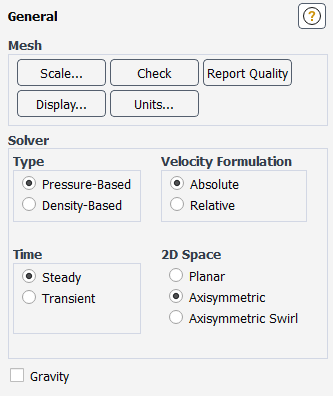

# Notes

## Ansys Fluent

User Interface Basics (DesignModeler + Mesher)

++strg++ + ++scroll wheel++ -> move
++scroll wheel++ -> tilt

### Workflow

1. Create Geometry in DesignModeler
    - click on XY-Plane
    - change form Modelling to Sketching
        - create sketch with drawing and constraints
        - add dimensions with dimensions
    - Highlight Sketch in Model tree -> Click Concepts -> Surfaces from Sketch
    - Click Generate
    - Check for errors in Model tree

2. Open mesher
    - name Edges (give usefull names e.g. inlet, outlet, wall_1, wall_2, ...)
        - select edge -> rightclick -> create named selection
    - create divisions (generate mesh near faces)
        - rightclick Mesh -> Insert -> Sizing
            - select edges -> Click Apply in Geometry tab
            - select type (e.g. Number of Devisions)
    - create inflation (create higher resolution near walls)
        - rightclick Mesh -> Insert -> Inflation
            - leave default settings
    - create method (create inner mesh)
        - rightclick Mesh -> Insert -> Method
            - highlight body -> Click Apply
            - Definition Tab
                - Method: MultiZone Quad/Tri
    - click Generate
    - view mesh by highlighting mesh in model tree

3. Setup
    - General
        - 
    - Models 
        - 
    - Materials
        - Add fluids
            - RightClick Fluids -> New
            - Highlight all needed fluids from Database -> Click Copy
        - Delete all fluids not used
            - RightClick Fluid -> Click Delete
    - Cell Zone Conditions
        - RightClick surface_body -> Edit -> Material Name: "fluid to use"

    - Boundry Conditions
        - inlet
            - 