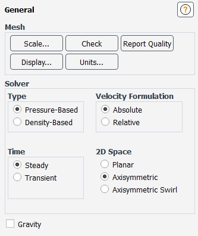
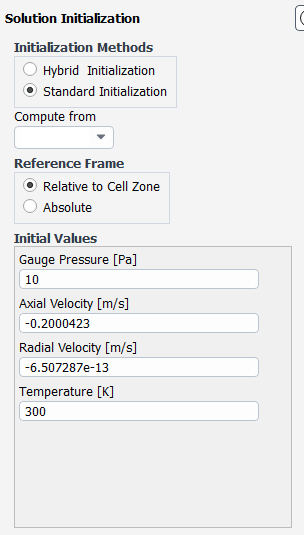
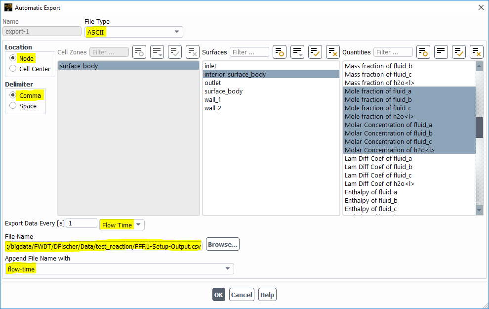
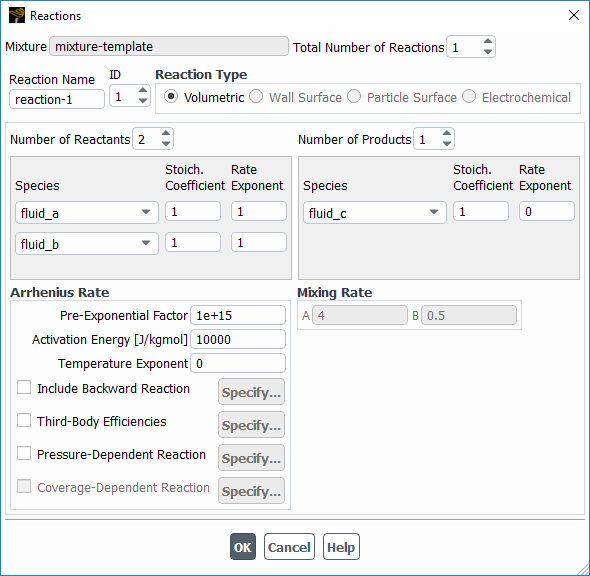

# Notes

## Ansys learning materials

- [CADFem](https://students.cadfem.net/de/elearning/ansys-fur-studenten-stromungssimulation-mit-ansys-fluent-17697.html)
- [Cornell University](https://confluence.cornell.edu/display/SIMULATION/FLUENT+Learning+Modules)

## Ansys Configuration

* Change UI language
    - go to ansys installation location
    - open (Ansys Inc -> Ansys Student -> v221(version number) -> ProductConfig.exe)
    - change language to desired one
## Ansys Fluent

User Interface Basics (DesignModeler + Mesher)

++strg++ + ++scroll wheel++ -> move
++scroll wheel++ -> tilt

### Workflow

0. First time opening
    - Drop **Fluent Flow(Fluent)** Workflow to Project
    - Doubleclick on Geometry
    - Close Window

1. Create Geometry in DesignModeler
    - rightclick **Geometry** -> **New DesignModeler Geometry...**
    - click on XY-Plane (Z arrow)
        - Axisymetric Problems
            - **radial direction**: y
            - **axial direction**: x (axis of rotation)
    - change from **Modelling** to **Sketching**
        - create sketch with drawing and constraints
        - add dimensions with dimensions
    - Highlight Sketch in Model tree -> Click **Concepts** -> **Surfaces from Sketch**
    - Click **Generate**
    - Check for errors in Model tree

2. Open mesher
    - name **Edges** (give usefull names e.g. inlet, outlet, wall_1, wall_2, ...) (shortkey ++N++)
        - select edge -> rightclick -> **create named selection**
    - create divisions (generate mesh near faces)
        - rightclick Mesh -> **Insert** -> **Sizing**
            - select edges -> Click Apply in Geometry tab
            - select type (e.g. Number of Devisions)
    - create inflation (create higher resolution near walls)
        - rightclick Mesh -> **Insert** -> **Inflation**
            - select Face -> click **Apply** under Geometry
            - select edges -> click **Apply** under Boundary
            - leave rest as default settings
    - create method (create inner mesh)
        - rightclick Mesh -> **Insert** -> **Method**
            - highlight body -> Click **Apply**
            - Definition Tab
                - Method: MultiZone Quad/Tri
    - click **Generate**
    - view mesh by clicking mesh in model tree

3. Setup
    - General
        - 
    - Models 
        - 
    - Materials
        - Add fluids
            - RightClick Fluids -> **New**
            - Highlight all needed fluids from Database -> Click **Copy**
        - Delete all fluids not used
            - RightClick Fluid -> Click **Delete**
        - Create Mixture
            - under models --> **Species** --> activate **Species Transport**
            - under materials --> **Mixture** --> ++rightclick++ --> mixture-template --> **Edit**
            - under **Mixture Species** --> Edit
                - add all created fluids to mixture
                - remove non used species from mixture
                - delete non used materials under materials tab

    - Cell Zone Conditions
        - RightClick surface_body -> **Edit** -> Material Name: "fluid to use"

    - Boundry Conditions
        - inlet
            - 
        - outlet
            - 

    - Methods
        - 

    - Contorls
        - 

    - Initialization
        - 

    - Run calculation
        - 

4. Solution
    - get a first impression of results
        - expand **Results** tab within model tree
        - expand **Graphics** tab
        - ++rightclick++ **Contours** -> **New**
        - select variable of interest from dropdown menus
        - click **Save/Display**
        - close settings window with **Close**

5. Results

    - export results 
        - create plane
            - highlight **Insert** in menu bar -> **Location** -> Plane
            - default settings are ok for this case
            - click **Apply**
            - plane should be visible within viewport
        - add results to plane
            - hihghlight **Insert** in menu bar -> **Contour**
            - select the just created plane at Locations
            - select the desired variable within Variable
            - click **Apply**
        - export data
            - highlight **File** in menu bar -> **Export** -> **Export...**
            - select just created plane at Locations
            - highlight variables that need to be exported (geometry information is already there due to ticked **Export Geometry Information**)
            - select export file location at **File**
            - click **save**

# Log Files
- Console output will be saved within `*.trn` file. The path to this file is: `.\tmp_files\progress_files\dp0\FFF\Fluent\Solution.trn`
- if u load a journal the `*.trn` file will be stored in the same location as the journal is read from

# Mesh dependancy study

1. Create paramerterized mesh
    - Create mesh
    - Add paramerts to control mesh size
        - e.g (number of divisions)
        - 
        - 
2. Add Export variable
    - `Report Definitions` --> `New` --> `Surface Report` --> `Facet Average`
    - 
3. Setup steady simulation
    - Mode: Steady
    - check that number of iterations is set high enough by running the case for some mesh --> Solution should converge!
4. Add parameter data
    - double click `Parameter Set` within workbench --> you should see the parameter table now (if not check that under View in menubar `Table` is checked `Messages` and `Progress` are usefull as well)
    - Add your parameter to table
    - Click `Update All Design Points`
        - sometimes it's usefull to only add 2-3 designpoints at a time to prevent crashing etc.
5. Export data
    - click into a cell
    - `rightclick` --> `Export Table data as CSV`
    - save data
6. Analyze data
    - when plotting the parameter it should at somepoint do not change very match with increasing mesh resultion. That is your meshsize

The average wall shear stress is mostly affected by the resultion within the perpendicular direction to the wall. Within the wall direction the value always increases slightly.

# Animations

## Create Animations
- click **Solution** tab --> Activities --> Create --> Solution Animations
    - 
    - Storage Type (PNG or JPEG for easier use later)
- run calculation (Initialize & Calculate)

## Remove Animation creation
- expand **Calculation Activities** within model tree
- expand **Solution Animations**
- delete Animation objects

# Data Export

## Create data export at every timestep (Transient Simulation)
- click **Solution** tab --> Activities --> Manage --> Create (under automatic Export)
    - 
    - File Type ASCII to be able to read data
    - File Name (including path) can have **.csv** extension for easier post processing but doesn't have to
    - Make shure `Export Data Every` has the option `flow time` set
    - Make shure `Append File Name with` has the option `flow time` set

## Getting units of export variables
- type units within search bar of FLUENT
- click on `User Definied -> Field Function -> Units...`
- click on the variable you want to see unit for
- unit used should be highlighted

# Intialize with species
- under **Initialize** menu --> Patch... --> set values --> click ++Patch++

# Parabolic velocity at inlet

1. Add variables
    - Add changed variables under `Named Expressions`
        - rightclick `Named Expression` --> `New` --> give name and value with unit (e.g. Name: vel_in | Definition: 1 [m/s]; Name: height | Definition: 0.006 [m])
2. Create equation
- under **inlet** setup click on dropdown menu --> select **expression** --> click on **f(x)** button and enter expression
- expression: `inp_vel/(height/2)**2 * ((height/2)**2- ((height/2) - Position.x)**2)`

# Add Reaction

## general
- think about reaction e.g. $ 1A + 1B \rightarrow 1C$
- think about reation rate e.g. $r = k \cdot c_A^{n_{c_A}} \cdot c_B^{n_{c_B}} $
    - e.g. $n_{c_A} = n_{c_B} = 1 $
    - $ k = k_{\infty} \cdot e^{\frac{-E_A}{R \cdot T}}$

## ansys configuration
- under Models --> Species --> ++rightclick++ --> edit
- under Reactions --> tick Volumetric
- under Mixture Properties --> click ++Edit++
- under Reaction (finite rate) --> click ++Edit++
    - 
    - Rate Exponent e.g. fluid a: $n_{c_A}$
    - Pre-Exponential Factor: $k_\infty$
    - Activation Energy: $E_A$

## troubleshooting
- No or few product C
    - activation energy $E_A$ to high ?
    - temperature to low ?
- No dispersion
    - input velocity and diffusion rate match? (diffusion rate << input vel ?)
    - flow time high enough (dependant on input velocity)

# Automation

## Commandline (holy grail)

### Run fluent from cmdline

- find flunet installation path (windows installation)
    - e.g. `C:\Program Files\ANSYS Inc\v221\fluent\ntbin\win64`
    - add this path to PATH variable (windows 10)
        - Go to **Settings** --> **System** --> **Info** --> **System Information** --> **Advanced System Settings**
        - login as root
        - go to tab **advanced** --> **Environment variables**
        - Doubleclick **Path** under system variables
        - click **new** --> paste your path here
        - click ok

- cmd: `fluent 2ddp -tX -i <journal>.jou -g`
    - X: number of processors

## GUI Application

- to automate the gui application these steps need to be done:
    1. Create case file (e.g. <name>.cas.gz)
        - ! Make shure [automatic data export](#data-export) is enabled or you will not get any results !
        - Click **File** in Menubar --> **Export** --> **Case**
        - Choose **.cas.gz** as filetype

    2. Create journal for case
        - Start journal (**File** in Menubar --> **Write** --> **Journal** (to record your steps))
        - do things (Change all parameters you want to change)
            - changing the data export path is necessary ortherwise fluent will ask for permission to overwrite existing results
        - Stop recording (**File** in Menubar --> **Write** --> **Stop Journal**)
    3. Look at your journal (should look somewhat similar to gui_template.jou)

    4. Create journal or append existing one

    5. Run new journal
        - Click **File** in Menubar --> **Read** --> **Journal** --> Choose your journal

# Scripts explaination

## Workflow to run case

1. Setup anys case within ansys workbench
2. Create journal file that edits all needed variables
3. Add marker (%variable name%) to base journal file
4. Add case to cases.json (within ansys folder)
5. Create and run journals with `journal.py`

## Running a new case

1. Make shure the directory the auto export writes files to is empty
    - if not run add_data.py

2. Make shure the case is setup within cases.json (you can put all relevant parameters here. helps if you need to look them up later ;-) )

3. Run the case

4. Take a look at the latest results with running watcher.py (Config is done in watcher.json)

## Workflow to create images

1. change `conf.json` within python directory acording to your needs
2. run `transient_field.py`
3. resulting images will be stored under `assets\<var_name>`

### Cases.json

| Variable|Explaination|Example|
|:--------:|:------------:|:------:|
|case_name|name of case to calculate. directory (see case_dir_path) will be created under data path if it doesn't exsist already | test |
|timestep|number of seconds per timestep| 0.01|
|data_export_interval| interval at which results will be created| 10|
|iterations| number of iterations per timestep | 30|
|timestep_number|number of timesteps to calculate|1e2|
|case|case to import first and then apply all variables| case_name.cas.gz|

### conf.json

|Variable|Explaination|Example|
|:-----:|:-----:|:-----:|
|cases_dir_path|path where cases are stored| ["\\\\gssnas", "bigdata", "fwdt", "DFischer" ,"Data"]
|cases| cases to create results for | ["test", "test1] |
|plots| timestamps that plots are created for | [], [-1, -2], [0, 10, 30] |
|create_resi_plot| if residual plots need to be created | false, true |
|create_image| if field needs to be created | false, true |
|field_var| variables that fields are created for | ["just put something here. if wrong u get shown all options"] |
|c_bar| colorbar label | velocity [m/s]
|image_file_type| image filetype | pmg, pdf, ...|
|set_custom_range| if custom range needs to be applied to field | true, false |
|min| minimum field_var value | 0 |
|max| maximum filed_var value | 1 |
|create_plot| if plots need to be created (averaged values over radius) | true, false |
|plot_vars| variables that are ploted| ["molef-fluid_a"]|
|plot_file_type| file type of plot | png, pdf, ... |
|one_plot| if multiple timesteps are ploted into one plot| true, false|
|plot_conf| plot config | |
|create_gif| if animation needs to be created (.gif file| true, false |
|video| if animation needs to be created (.avi file) | true, false |
|cases| animation image selection | |
|new| if existing images should be replaced | true, false |
|keep_images | if gif images are deleted after gif creation | true, false |
|gif_plot | if animation needs to be done for plots | true, false |
|gif_image | if animation needs to be done for fields | true, false |
|name | gif and video name | "bla"|
|loop | how many times gif and video needs to loop | 0 |
|frame_duration| how long in [ms] a frame should be displayed | 200 |

# Experimental Setup

- Heights:
    - 0.2 [mm] --> 0.072 [ml/min] --> 0.0019 [m/s] 
    - 0.4 [mm] --> 0.144 [ml/min] --> 0.0019 [m/s]
    - 0.6 [mm] --> 8.22  [ml/min] --> 0.0727 [m/s]

- Radius:
    - 50 [mm]

- Inner Tube Diameter
    - 1 [mm]

- Pe Numbers 50 ... 1e4
- Sc Numbers for Fluids ~ 1e3

# HPC Cluster calculations

## Preparations

1. Apply for cluster access
    - Open Ticket for cluster access at [Ticket Portal](https://ticket.hzdr.de:20002)

## Steps

1. Generate case
    - Do all setup in Fluent GUI then export case & data
        - for this step to be able to execute the case must be run for one iteration to generate the data file
    - this step can be automated as well (see `cmd_creation_template.jou`)
2. Setup journal to run case
    - see journal `cmd_template.jou` within ansys --> journals folder
3. Test journal
    - Run journal commands within Terminal window of ansys fluent to check everything is working as intended
4. Create skript to run case
    - Look at `fluent_template.sh` within hpc folder
    - Important variables:
        - ntasks-per-node : task per node
        - time: wall_time maximum runtime for the case (max 96:00:00 --> 96hours = 4days)
        - p: queue to run case in (default defq)
        - J: job_name to indentify job in queue. Multiple jobs can have the same name but it's not recommended
5. Run case
    - put case into queue `sbatch case.sh`
6. Check queue for case
    - see all your jobs with `qstat -u $USER`